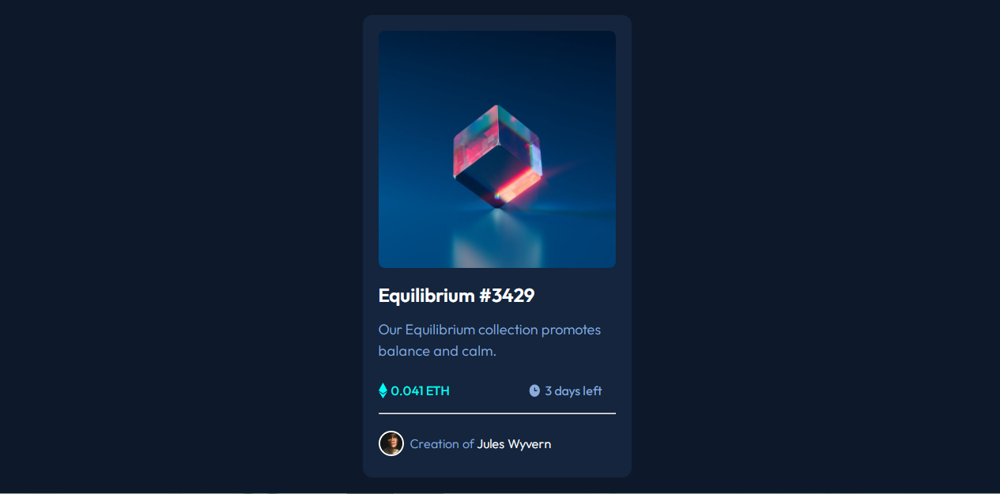

# Frontend Mentor - NFT preview card component solution

This is a solution to the [NFT preview card component challenge on Frontend Mentor](https://www.frontendmentor.io/challenges/nft-preview-card-component-SbdUL_w0U). Frontend Mentor challenges help you improve your coding skills by building realistic projects. 

## Table of contents

- [Overview](#overview)
  - [The challenge](#the-challenge)
  - [Screenshot](#screenshot)
  - [Links](#links)
- [My process](#my-process)
  - [Built with](#built-with)
  - [What I learned](#what-i-learned)
  - [Continued development](#continued-development)
  - [Useful resources](#useful-resources)
- [Author](#author)
- [Acknowledgments](#acknowledgments)

## Overview

### The challenge

Users should be able to:

- View the optimal layout depending on their device's screen size
- See hover states for interactive elements

### Screenshot



### Links

- Solution URL: [Add solution URL here](https://your-solution-url.com)
- Live Site URL: [https://wattswebdev.github.io/NFT-preview-card-component/]

## My process

  This has been my favorite FEM project yet. I enjoyed working with the colors. In this project I satrted with buidling the HTML structure so I could design the card as closely as possible with the design.

### Built with

- Flexbox
- Mobile-first workflow

### What I learned

In this project i learned how to get an overlay over an image.

To see how you can add code snippets, see below:

```.overlay {
    position: absolute;
    top: 0;
    bottom: 0;
    left: 0;
    right: 0;
    height: 99%;
    width: 100%;  
    opacity: 0;
  }

.overlay:hover {
    opacity: 0.5;
    background-color: hsl(178, 100%, 50%);
    cursor: pointer;
    transition: .5s ease;
    border-radius: 8px;
  }
  
.overlay:hover .eye-icon {
    position: absolute;
    top: 50%;
    left: 50%;
    transform: translate(-50%, -50%);
    text-align: center; 
    opacity: 1;
  }
```

### Continued development

I want to continue to learn how to incoperate cool effects in my webpages using CSS. I also want to get better with desging for mobiel responiveness across viewports.

### Useful resources

- [W3Schools](https://www.w3schools.com/howto/howto_css_overlay.asp) - This helped me with getting an overlay over my main image.

## Author

- Website - [Jakia Watts](https://wattswebdev.github.io/my-portfolio/)
- Frontend Mentor - [@WattsWebDev](https://www.frontendmentor.io/profile/
